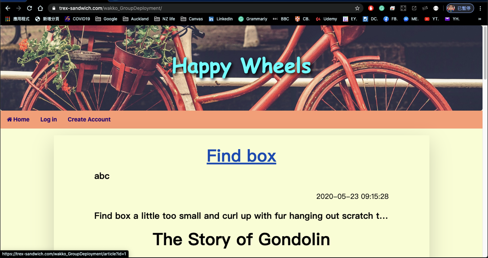
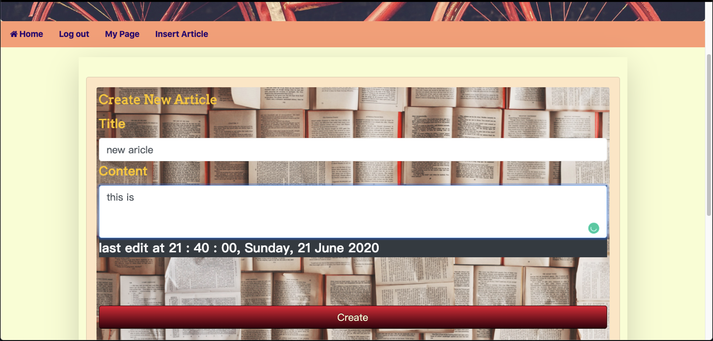

# HappyWheels
This is the final project for the PGCIT program of University of Auckland. HappyWheels is a blog system created in a team of three. Other creators: Jerry Lin, Subha Sharma
## Introduction
HappyWheels is a blog website, where you can post articles and communicate with others. It allows users to create and management their accounts, posting articles, commenting on articles and on other comments, browse others personal page and more. 

### Brief instruction for using HappyWheels blog system:

1. At the beginning, HappyWheels will display a list of article that store in database. Each article has hyper link on title and author that allow user to click. User can't do anything until they click login button that on nav bar. If user don't have account, they also can create one.
  
- Homepage

    
2. After user successfully login, HappyWheels will display current login user's basic information and a list of article belong to this user. At this moment, user can do more than just browsing articles.
  
- Login page

  
3. First, at the user's personal homepage, they can edit account, edit/delete the article, and create new article. In the edit account page, they can update their account information and also have a choice to delete current account.
    
- Personal home page when logged in 

  
4. Second, user can browse the list of all article by clicking "HOME" button that on the nav bar. User can see more details by clicking article's title. Furthermore, user can add comment to current article or others comment. The maximum level of nested comments is 3 levels.

- Three levels comments

    
5. Third, user can create new article by clicking "Insert Article", the page will let user input title and content of new article. After clicking create button, HappyWheels store that time and display all content to the user.
    
6. Fourth, if user want to go back to their personal homepage, they can click on "My Page" button and HappyWheels will redirect to personal homepage.
    
7. Finally, user can click "Log Out" button to leave and Happy Wheel will redirect to the page that display a list of article.
  
### Features
- Account creation

  
- Edit account

  
- Create posts

  
- Show/Hide comments

- Post comments on articles

  
- Post comments on other comments

  

